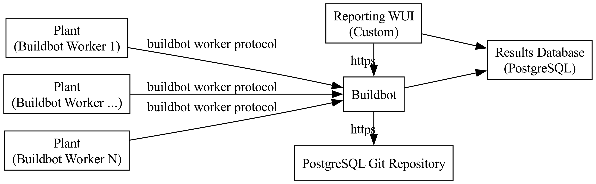
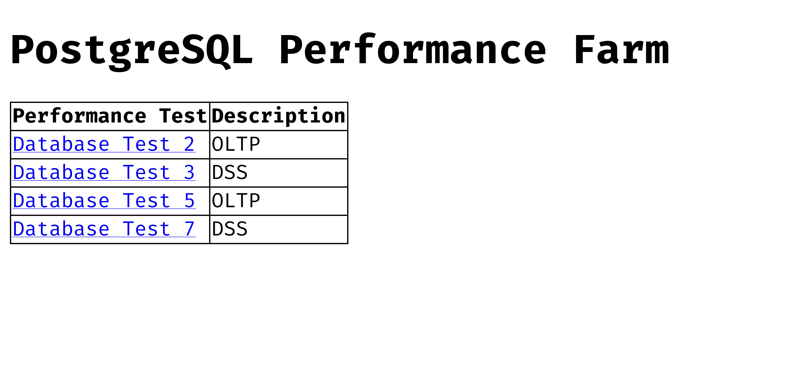
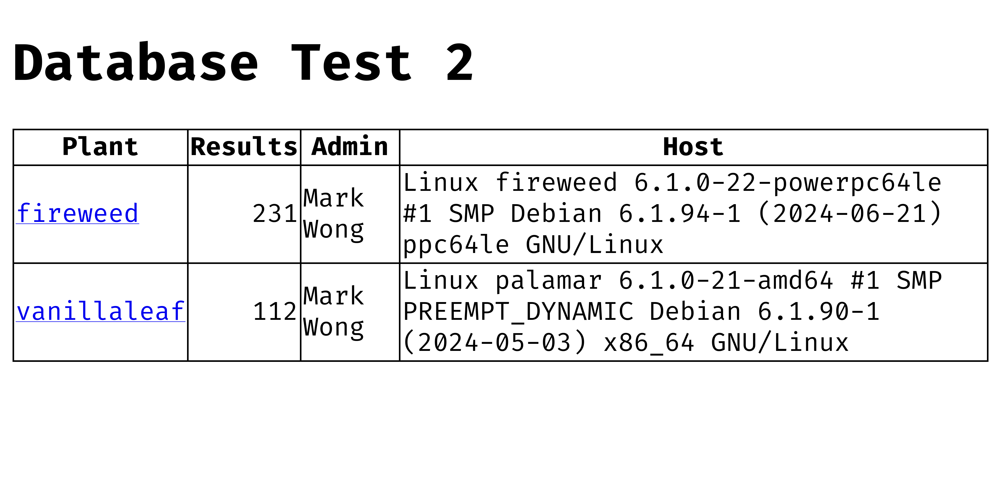
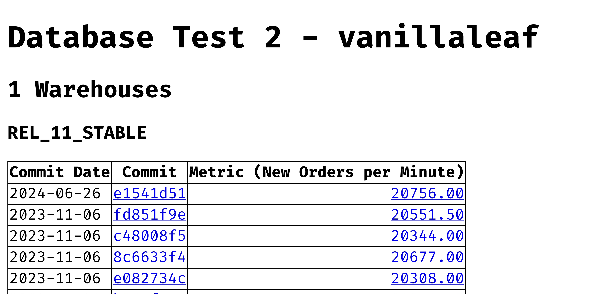
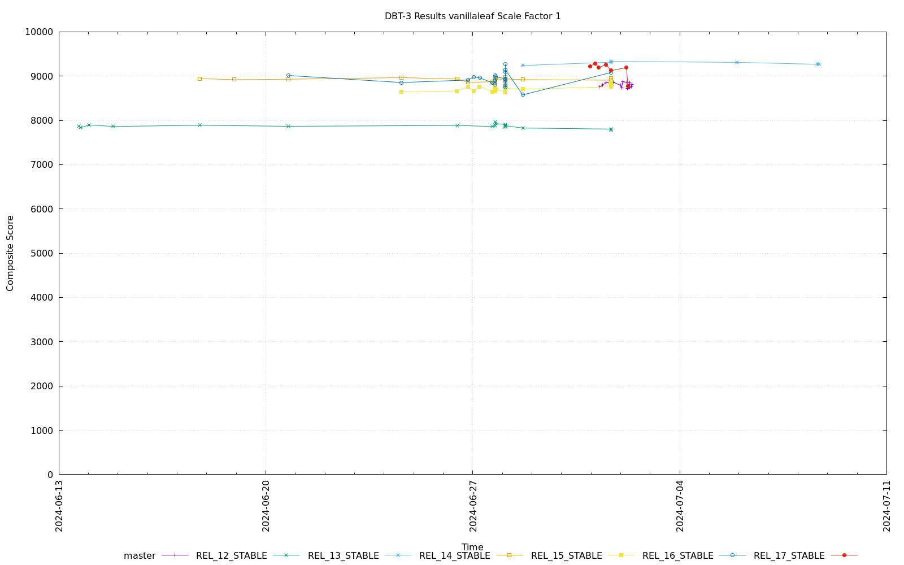

===========================
PostgreSQL Performance Farm
===========================

   Performance farm system architecture

.. contents::

Purpose
=======

The PostgreSQL Performance Farm is a continuous performance testing
implementation intended to help identify significant performance changes in the
PostgreSQL source code.

This implementation revolves around using `Buildbot <https://buildbot.net>`_ to
track changes in the PostgreSQL source code, i.e. only in the `src` directory,
and launch performance tests.

Using an existing continuous integration tool allows us to focus our
development efforts on canning performance tests and building a reporting
system for reviewing performance data.

Performance Tests
=================

A continuous integration system is better suited for canning performance tests
as opposed to providing a full featured benchmarking interface, so the
performance tests are most easily implemented by limiting how each test is
executed.

Buildbot still provides facilities such that each plant can have its own
specific set of PostgreSQL or performance test configuration defaults.
Different hardware should be tested with difference parameters. For example,
PostgreSQL *shared_buffers* sized based on available RAM, or the scale factor
of a test based on available storage.

A performance test can be configured to run on a select number of plants. In
other words, not all plants need to run all performance tests.

The initial set of performance tests include a variety of OLTP and DSS
workloads:

1. TPC-C fair-use implementation
2. TPC-E fair-use implementation
3. TPC-H fair-use implementation
4. TPC-DS fair-use implementation

Additional Features for Privileged Users
========================================

Buildbot's facilities can be extended to allow privileged users to use its Web
interface or RESTful API to:

1. Initiate a test for specific plants
2. Upload a patch against PostgreSQL or the performance test
3. Override the plant's default PostgreSQL or performance test parameters

Reporting
=========

The performance farm will report results such that performance trends can be
perused by test per machine. For example, a starting point would be to see a
listing of the performance tests run, then drill down by performance test, then
by plant, then by branch to see results.

The reporting interface should also give some kind of indication of whether
recent patches have negatively or positively affected any of the performance
tests.

Buildbot provides facilities so that custom `plugins
<https://docs.buildbot.net/current/manual/plugins.html>`_ can be developed for
custom dashboards.  But due to the team's current lack of experience, we are
continuing to proof a reporting system using a separate minimal Web framework.

One possible benefit of this is to provide a separate read-only application for
reporting from a privilege Buildbot interface.

Mock Ups
--------

Example of a home page listing all of the performance tests:

   Home page: list of performance tests

Example of all of the plants running a performance test:

   Plants Running DBT-2

Example of the results of a performance test listed by branch:

   vanillaleaf's DBT-2 results

Example of visualizing a plant's historical results for a specific test,
static example created by using gnuplot instead of a Web application:

   vanillaleaf DBT-3 Scale Factor 1 Results

Sizing
======

The proof of concept system's database space measurement is approximately 500
KB per test.

Using `Peter Eisentraut's reportied numbers
<https://peter.eisentraut.org/blog/2024/04/11/postgresql-17-commitfest-conclusion>`_
let's grossly over estimate 500 patches per supported branch (5) per test (4)
per animal.

This would bring us to a round number of 10 MB of grows per animal per year.
For 10 animals, 100 MB per year.

Buildbot is currently only saving the following data and test output as text in
its default schema in the database:

1. Test metrics
2. System statistics: sar and pidstat output
3. PostgreSQL parameters
